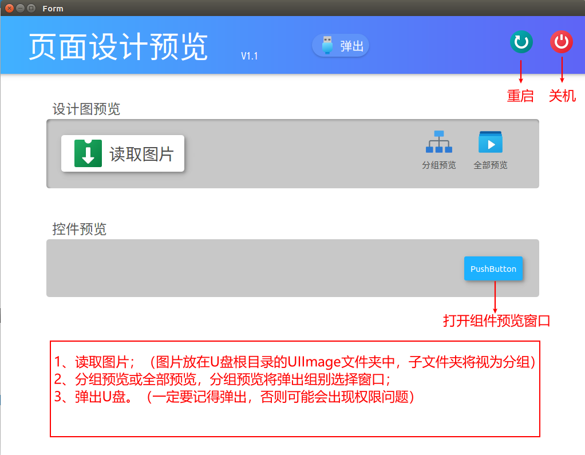
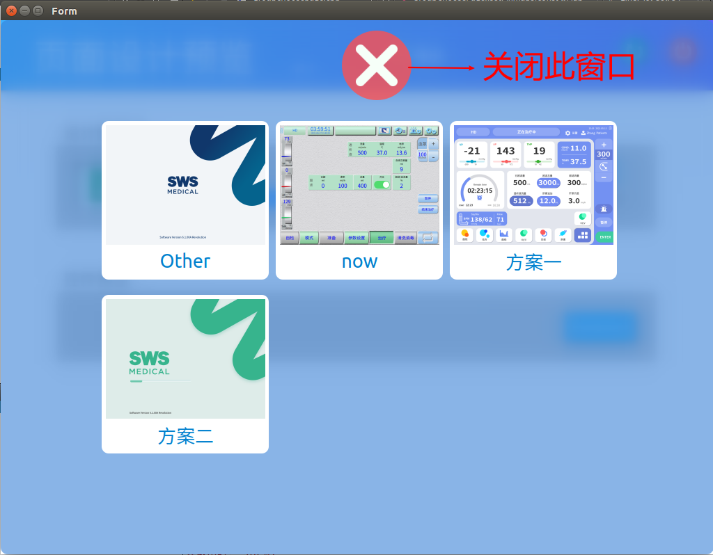
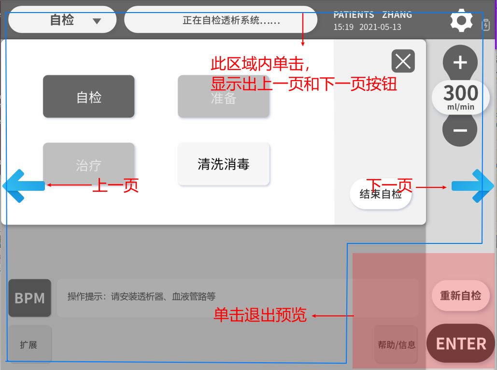
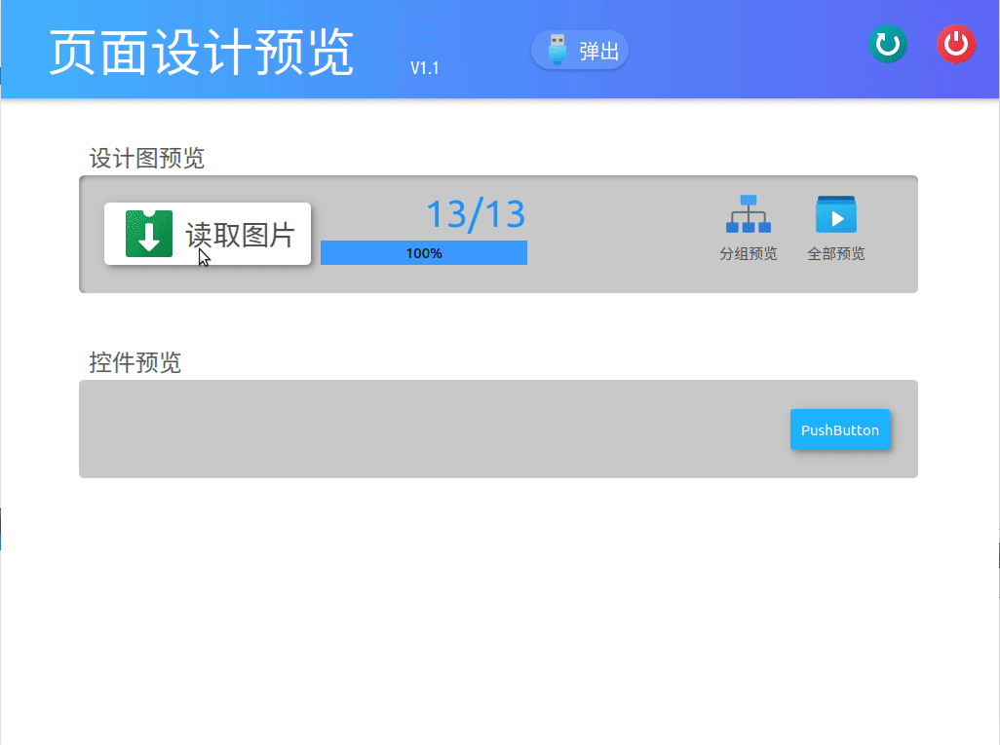
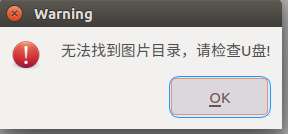
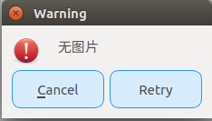

# SWS6000NewUITestTool

SWS6000型新UI测试工具，用于在新UI设计过程中测试相关设计方案的显示效果。

## 功能

- [x] 设计图预览（支持png、jpg类型的图片）

- [x] 从U盘加载设计图

- [x] 分类预览

- [x] 关机

- [x] 重启

- [x] 组件预览

###  功能说明

- `主窗口`

  

- `组别选择窗口`

  

- `预览窗口`

  

## 使用方法

1. 将程序复制到机器系统的`root`目录下，替换原有的主控程序`SWS-6000-Revolution`。
2. 准备需要预览的图片：

   1. 在U盘中新建文件夹，命名为`UIImages`。
   2. 将需要预览的文件复制到U盘中的`UIImages`文件夹中。
3. 开机，插入U盘，UI测试工具会自动启动，显示`主界面`。
4. 点击`加载图片`按钮，程序将把U盘中`UIImages`文件夹中的图片加载进程序中，加载过程中有进度提示。
5. 等待加载完成后点击`预览`按钮，弹出`预览界面`，开始预览图片。

   - 预览中单击左下角区域将退出预览

   - 预览中单击任意位置将显示`上一张`和`下一张`按钮，点击对应按钮实现翻页（所有图片循环滚动）。

   - 未触碰屏幕超过3s，`上一张`和`下一张`按钮将自动隐藏。
6. 在`主界面`点击`关机`按钮，程序将自动关机，需要手动按硬件开机键才能开机。
7. 在`主界面`点击`重启`按钮，机器将自动重启。
8. 在`主界面`点击`弹出U盘`按钮，将安全弹出U盘。

### 使用示例：

## 错误处理

目前有两种错误提示：

1. `无法找到图片目录，请检查U盘`

   

   出现此提示，说明没有找到U盘或者U盘中没有`UIIamges`文件夹，请点击`Ok`后点击`弹出U盘`并拔出U盘后重新在U盘中建立`UIIamges`文件夹，并放入要预览的图片，最后再次插入机器的USB接口，重新读取。

2. `无图片`

   

   出现此提示，说明已经找到`UIIamges`文件夹，但没有找到支持的图片，你有两种选择：

   1. 点击`Retry`重试，重新读取U盘内容。
   2. 点击`Cancel`，取消图片加载，然后点击`弹出U盘`，并重新在U盘中的`UIIamges`文件夹中放入要预览的图片，且保证图片格式为jpg或png，最后再次插入机器的USB接口，重新读取。

## svn
[SWS6000NewUITestTool](svn://192.168.30.247/swsoft/SWS6000/master-soft/code/demo/SWS6000NewUITestTool)
